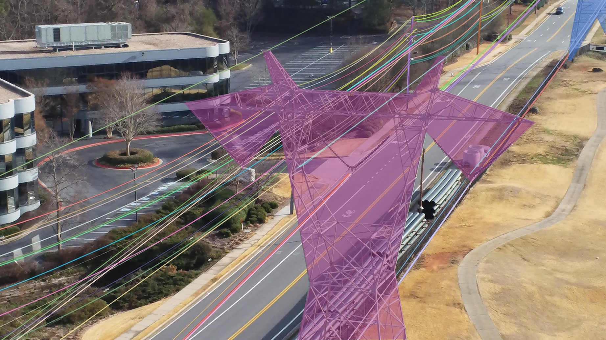

# TTPLA: An Aerial-Image Dataset for Detection and Segmentation of Transmission Towers and Power Lines

TTPLA is a public dataset which is a collection of aerial images on
Transmission Towers (TTs) and Powers Lines (PLs). This is the official repo of paper [TTPLA: An Aerial-Image Dataset for Detection
and Segmentation of Transmission Towers and
Power Lines](camera_ready_final.pdf). 



The repository includes:
* original images of TTPLA.
* pixel level annotation in COCO format.
* text files contain a list of images names after splitting to train, validate, and test.
* weights of training model using two different backbones and three different image sizes.

### Directors:
```
* `data_original_size/` contains the original images and annotations with the original size
* `data_700x700/` : contains the images and annotations with the 700x700 size.
* `data_550x550/` : contains the images and annotations with the 550x550 size.
* `data_640x360/` : contains the images and annotations with the 640x360 size.
```
### Splitting:
```
* `train.txt`: it contains the names of the train images.
* `val.txt`: it contains the names of the validation images.
* `test.txt`: it contains the names of the test images.
```
### Scripts:
```
* `resize_image_and_annotation-final.py` it is used to resize the images to target size.
* `remove_void.py` it is used to remove the void label if needed from data.
* `split_data.py` it is used to initially split the data. Then, the data is further manually filtered.
```


## Preparation data:

1. Modify `resize_image_and_annotation-final.py` to use the target image dimension (line 10). Then, call the script using
`python resize_image_and_annotation-final.py -t <images_path>`. It will produce new folder called `sized_data`, you may renamed to whatever is fit.

2. Then call `remove_void.py` to remove `void` label if you would like to remove it.
`python remove_void.py -t <sized_images_path>`. It will produce new folder called `newjsons`, you may renamed to whatever is fit.

3. Based on three lists of train.txt, test.txt, and val.txt, `split_jsons.py` is used to split the created `newjsons` to three folders `train` , `val`, and `test` to prepare this before get the `COCO` json file.You can use the following command.
`python split_jsons.py -t newjsons/`. It will produce new folder called `splitting_jsons`, you may renamed to whatever is fit.

5. Use `labelme2coco_2.py` to get the `COCO_json` that used by `Yolact`.
`python labelme2coco_2.py splitting_jsons/train_jsons/`. This step is done for three folders `train_jsons` , `val_jsons`, and `test_jsons`.


## Installation:
* Clone [Yolact](https://github.com/dbolya/yolact#evaluation) repository and enter it:
```
git clone https://github.com/dbolya/yolact.git
cd yolact
```
* Set up the environment using one of the following methods:
    * Using  [Anaconda](https://www.anaconda.com)
        * Run ```conda env create -f environment.yml```
    * Manually with pip
        * Set up a Python3 environment (e.g., using virtenv).
        * Install Pytorch 1.0.1 (or higher) and TorchVision.
        * Install some other packages:
            ```
          pip install cython
          pip install opencv-python pillow pycocotools matplotlib
          ```
## Train Model:
```
python eval.py --trained_model=weights/yolact_base_54_800000.pth

```

## Evaluation:

|Image Size| Backbone|configs| weights|
|:-------------:| ------------- |:-------------:| -----:|
|640 x 360 |Resnet50 | [config_img640_resnet50_aspect.py](https://drive.google.com/file/d/1ocoYiTDFBcdI8Es8dZlMbsbFGkaLKw98/view?usp=sharing)| [yolact_img640_secondval_399_30000_resnet50.pth](https://drive.google.com/file/d/1IDfQlBJ2VAIpyaOSUs2Ecmf_rsl8nSdc/view?usp=sharing)|
|550 x 550 |Resnet50 | [config_img550_resnet50.py](https://drive.google.com/file/d/1buxmIli7cxiFwJ7krOCTOojwgDeR2AUM/view?usp=sharing0)   | [yolact_img550_399_30000_resnet50.pth](https://drive.google.com/file/d/1mKYRP7LOVgrFN5Vsug-tyI6XDEZ8c62k/view?usp=sharing) |
| 700 x 700|Resnet50 | [config_img700_resnet50.py](https://drive.google.com/file/d/1NCe8W7QKlDhDF-nrH2iLAr0kiHdC6T7w/view?usp=sharing)  | [yolact_img700_399_30000_resnet50.pth](https://drive.google.com/file/d/1y8g-KepFdcSBWKRdHTHB8vygjKsFTyKr/view?usp=sharing) |
|640 x 360 |Resnet101| [config_img640_resnet101_aspect.py](https://drive.google.com/file/d/1sq3WSdH-wqRLbIaZO9g4uBYA6WQec3uC/view?usp=sharing)| [yolact_img640_secondval_399_45100_resnet101.pth](https://drive.google.com/file/d/1IDfQlBJ2VAIpyaOSUs2Ecmf_rsl8nSdc/view?usp=sharing) |
|550 x 550 |Resnet101| [config_img550_resnet101.py](https://drive.google.com/file/d/1XM7ryEokOe98Y6XNmx9qvuK8rPujoJvL/view?usp=sharing)| [yolact_img550_399_45100_resnet101_b8.pth](https://drive.google.com/file/d/1zP4usEnaAUeGuqq179iLocy2J5TO4eJH/view?usp=sharing) |
|700 x 700 |Resnet101| [config_img700_resnet101.py](https://drive.google.com/file/d/1QfPvi2FTJv1JByqM70qM7nQjGpNI_kNi/view?usp=sharing)| [yolact_img700_399_45100_resnet101_b8.pth](https://drive.google.com/file/d/1IDfQlBJ2VAIpyaOSUs2Ecmf_rsl8nSdc/view?usp=sharing)|

## Results:

Average Precision for Different Deep Learning Models on TTPLA is reported in the following table


## Citation:
```
@inproceedings{ttpla-accv2020,
  author    = {Rabab Abdelfattah, Xiaofeng Wang, Song Wang},
  title     = {TTPLA: An Aerial-Image Dataset for Detection and Segmentation of Transmission Towers and Power Linesn},
  booktitle = {ACCV},
  year      = {2020},
}
```
## Contact:
For questions about our paper or code, please contact [Rabab Abdelfattah](rabab@email.sc.edu).
